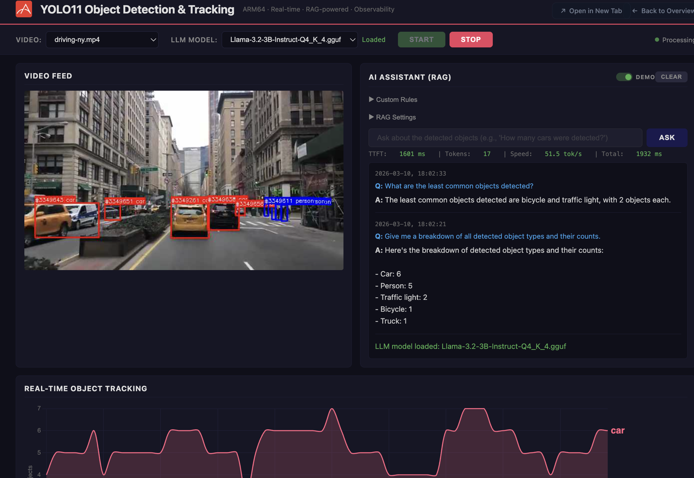
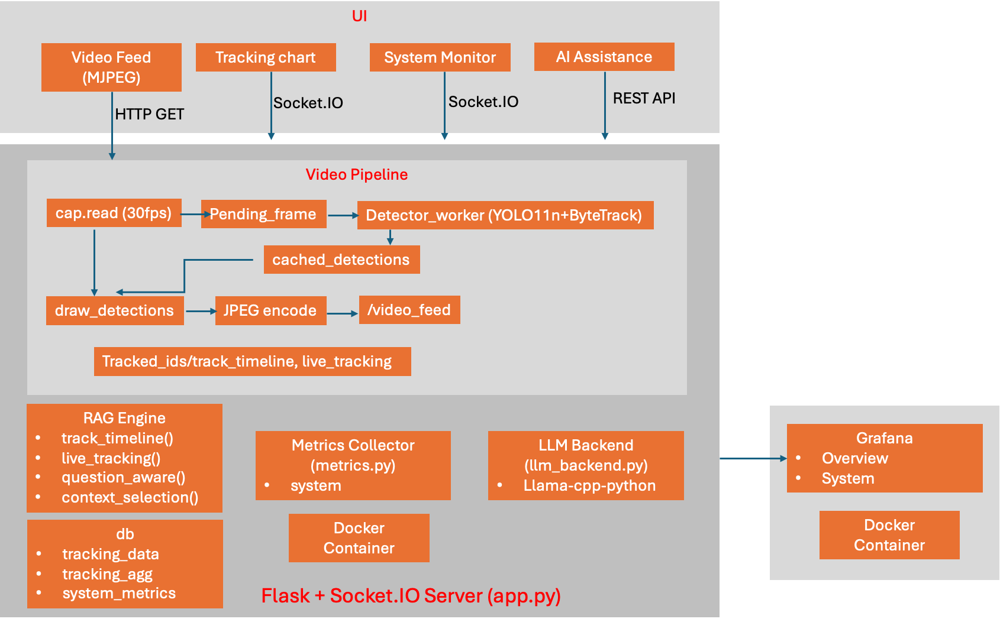

# YOLOv11 Object Detection and Tracking
## User Interface
This is a real-time video analytics platform showcasing AI on Ampere CPUs.  It combines four capabilities in one dashboard:
- Object Detection & Tracking - YOLOv11 inference with Bytetrack assigns persistent IDs to objects across frames, drawn live on an MJPEG video feed.
- Local LLM Q&A with RAG - A GGUF model (via llama-cpp-python) answer natural language questions about what happening in the video, with question aware section selection so the LLM only sees relevant data.
- Observability - Time series metrics stream to a Flask + SOcket.IO web UI and a companion Grafana dashboard.


## Architectural Diagram
This demo is a Flask + Socket.IO single process app that run YOLOv11 + ByteTrack inference on video frames, streams annotated MJPEG and live metrics to a vanilla-JS dashboard - all coordinated by background threads optimized for Ampere processors. A local GGUF LLM (via llama-cpp-python) answers questions about the scene using RAG context built from the live tracking timeline. 



## What This Demo Shows
The demo showcases real-time video analytics running entirely on Ampere processors - no GPU required.   Specially, it demonstrates:
- **Live object detection and tracking** - YOLOv11 + ByteTrack assigns persistent IDs to people, vehicles, and other objects as they move through the scene.
- **Deployed LLM Q&A** - A local GGUF model answer natural language questions using RAG context built from the tracking timeline.
- **Production-grade observability** - Live FPS, tracked, and visible objects,  CPU and Memory gauges

## Target Audience
The demo is built to speak to several groups:
- Enterprise buyers - IT decision makers evaluating Ampere servers for AI workloads.  Who need proof that Ampere CPUs can run modern vision + LLM stacks without GPUs.
- Cloud & Edge infrastructure architectures - Engineers designing video analytics, smart-retail, smart-city, or industrial monitoring deployments where GPU cost, power, or supply constraints matter.
- Solution partners & ISVs - Companies building video analytics products who could port or co-develop on Ampere, using this as a reference architecture (detection + tracking + RAG + observability in one container)
- Trade show & briefing center visitors - Non technical executives and analysts who need a visually compelling, self running demo that tells the “full AI stack on Ampere“ story at a glance.


----------
# yolov11-with-rag - How-to
### Getting Started
1. **Download** the Ampere optimized 'Llama-3.2-3B-Instruct-Q4_K_4.gguf' model from [Hugging Face](https://huggingface.co).
2. **Place** the model inside the `models/` directory.
3. **Place** the videos inside the `videos/` directory.
4. **Run** the setup script:
   ```bash
   ./start_app.sh

**The script** will pull the demo docker image from docker hub, setup the environments neccessary for this demo.

**Open** the demo at http://< your_ip_address >:5070
